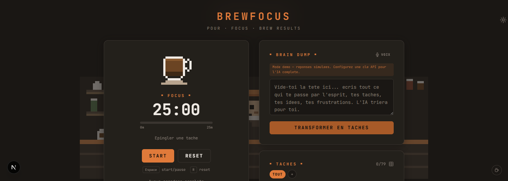
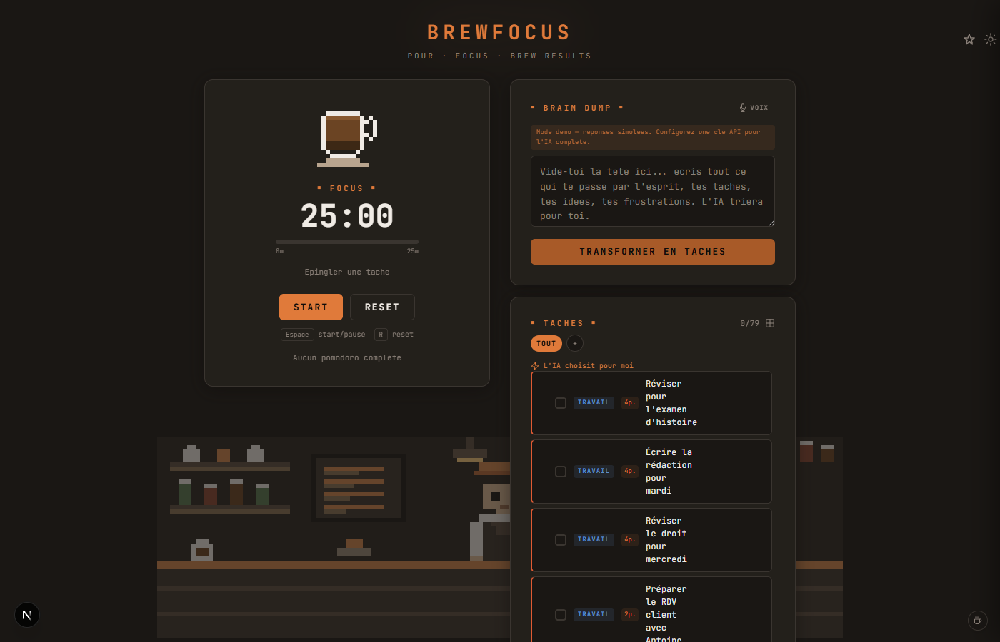
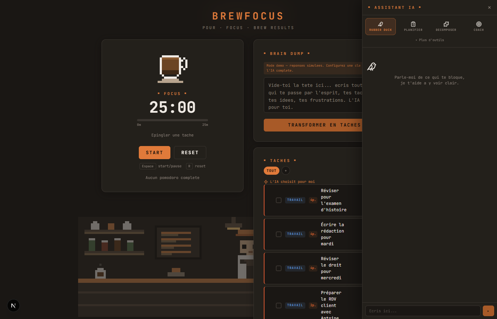
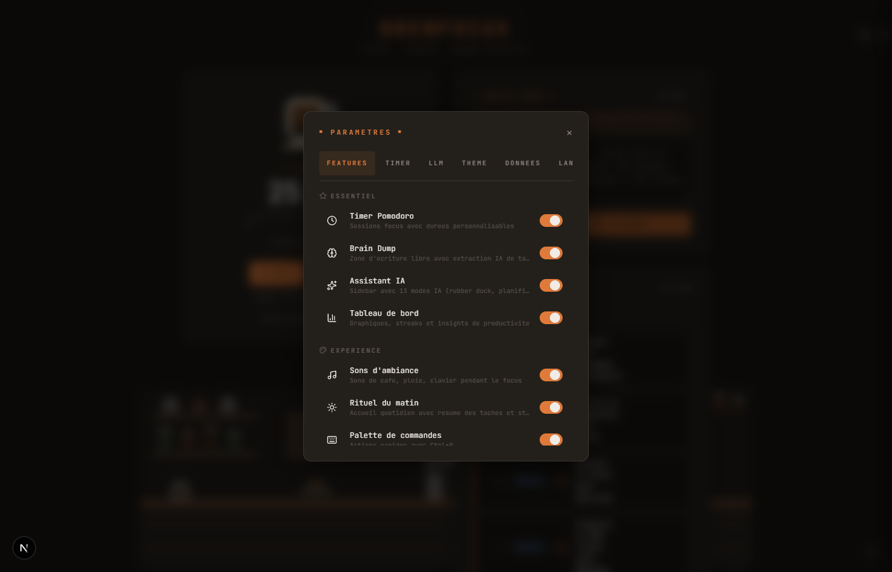
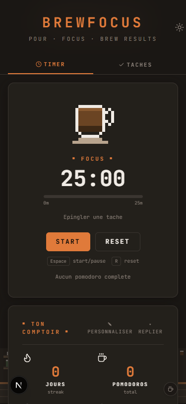

<div align="center">
  

  <br />
  <br />

  <h1>BrewFocus</h1>

  <p><strong>The ADHD-friendly productivity app with a pixel art cafe vibe.</strong></p>

  <p>Brain dump your chaos, let AI sort it, then crush your tasks one pomodoro at a time.</p>

  <br />

  <a href="#-quick-start">Quick Start</a> ·
  <a href="#-features">Features</a> ·
  <a href="#-adhd-first-design">ADHD-First</a> ·
  <a href="#-tech-stack">Stack</a> ·
  <a href="#-contributing">Contributing</a>

  <br />
  <br />

  [](https://github.com/Tenshyy/brewfocus/actions/workflows/ci.yml)
  [](https://nextjs.org/)
  [](https://react.dev/)
  [](https://www.typescriptlang.org/)
  [](https://tailwindcss.com/)
  [](https://web.dev/progressive-web-apps/)
  [](#-internationalization)
  [](LICENSE)

</div>

<br />

> [!NOTE]
> BrewFocus works out of the box with **zero setup** — demo mode requires no API key. For real AI, grab a free key from [Groq](https://console.groq.com) in 30 seconds.

<br />

## Preview

<div align="center">
  <picture>
    
  </picture>
  <br />
  <sub>Desktop — Timer, Brain Dump, Tasks with AI estimation, Pixel Art Cafe</sub>
</div>

<br />

<div align="center">
  <table>
    <tr>
      <td align="center">
        
        <br />
        <sub>AI Assistant (10+ modes)</sub>
      </td>
      <td align="center">
        
        <br />
        <sub>Feature Toggles</sub>
      </td>
      <td align="center">
        
        <br />
        <sub>Mobile PWA</sub>
      </td>
    </tr>
  </table>
</div>

<br />

---

## The Problem

Traditional productivity tools feel like work *about* work. They're rigid, overwhelming, and **not designed for brains that think in 47 directions at once**.

BrewFocus flips the script:

1. **Dump** everything in your head into a text box
2. **AI** turns your messy thoughts into organized, prioritized tasks
3. **Focus** through them with a cozy Pomodoro timer while a pixel art barista animates in the background

No signup. No accounts. No tracking. Just you, your tasks, and a warm cafe.

---

## Quick Start

```bash
git clone https://github.com/Tenshyy/brewfocus.git
cd brewfocus
npm install
npm run dev
```

Open [localhost:3000](http://localhost:3000) — works immediately in demo mode.

### Connect Real AI (optional)

| Provider | Cost | Setup |
|----------|------|-------|
| **Groq** | Free | [Get key](https://console.groq.com) → Settings → LLM → paste |
| **Anthropic** | Paid | Claude models, best quality |
| **OpenAI** | Paid | GPT-4o-mini and others |
| **Ollama** | Free | Run locally, fully private |

> Your API keys never leave your browser. BrewFocus uses a BYOK (Bring Your Own Key) model — keys are stored in `localStorage` and sent directly to your chosen provider.

---

## Features

### Brain Dump + AI

Write (or dictate) everything on your mind. AI parses your stream of consciousness into:

- **Categorized tasks** — work, personal, admin, ideas
- **Priority levels** — high, medium, low with color-coded borders
- **Pomodoro estimates** — calibrated to your personal history
- **Parking lot** — things that aren't tasks yet

### Pixel Art Pomodoro Timer

A coffee cup that fills as you focus. Visual progress bar for time awareness. Configurable presets (15/25/50 min), break timer, sound + system notifications, and keyboard shortcuts.

### AI Assistant (10+ Modes)

A sidebar with specialized AI tools designed for ADHD workflows:

| Mode | What it does |
|------|-------------|
| **Rubber Duck** | Chat through blockers with a friendly barista |
| **Planner** | AI organizes your day from your task list |
| **Decompose** | Break a big scary task into small steps |
| **Coach** | Personalized productivity tips based on your data |
| **Review** | Day/week summary — copy-paste into standups |
| **Draft** | Write emails, messages, docs from a prompt |
| **Inbox** | Triage notifications and emails into tasks |
| **Overload** | Too many tasks? AI helps you cut ruthlessly |
| **Focus Brief** | Mini-brief before starting a pomodoro |
| **Weekly Review** | Full weekly recap with wins, challenges, insights |
| **Choose For Me** | Can't decide? AI picks the best task to start NOW |

### Stats Dashboard

Customizable, draggable widgets: streaks, focus hours, completion rate, category breakdown, personal bests, 3-month activity heatmap, and exportable weekly/monthly Markdown reports.

### Feature Flags

Every feature can be toggled on/off from Settings. Don't use stats? Hide them. Don't want the barista? Turn it off. **Nothing is forced** — you control exactly what you see.

### Everything Else

| Feature | Details |
|---------|---------|
| **Drag & drop** | Reorder tasks by dragging |
| **Eisenhower Matrix** | Priority matrix view toggle |
| **Recurring tasks** | Daily, weekly, or custom schedules |
| **Projects** | Group tasks with color coding |
| **Morning ritual** | Daily greeting with streak, tasks, and AI planning |
| **Voice input** | Hands-free brain dumps via speech recognition |
| **Gamification** | Daily goals, streak badges, confetti celebrations |
| **Focus View** | Simplified 3-task view for decision fatigue |
| **Post-pomodoro transition** | Celebration + break suggestions after each focus |
| **Command palette** | `Ctrl+P` for quick actions |
| **Auto-backup** | Every 5 minutes + JSON export/import |
| **Server sync** | Persistence across sessions |
| **PWA** | Installable on any device |
| **i18n** | French and English |
| **Keyboard shortcuts** | Throughout the entire app |
| **Error boundaries** | Per-feature crash isolation |
| **Reduced motion** | Respects `prefers-reduced-motion` |

---

## ADHD-First Design

BrewFocus isn't a generic productivity app with an ADHD label. Every feature was designed around specific ADHD challenges:

| ADHD Challenge | BrewFocus Solution |
|---|---|
| **Decision paralysis** | "AI picks for me" button — zero decisions needed |
| **Time blindness** | Visual progress bar + color shift under the timer |
| **Task initiation** | Brain dump lowers the barrier — just write, AI handles the rest |
| **Overwhelm** | Feature flags to hide complexity. Focus View shows max 3 tasks |
| **Dopamine deficit** | Confetti celebrations, streak badges, post-pomodoro transition |
| **Context switching** | Pin a task to the timer — one task, one pomodoro, one focus |
| **Hyperfocus crashes** | Break suggestions with physical activities after each session |
| **Sensory sensitivity** | `prefers-reduced-motion` support disables all animations |
| **Working memory** | Morning ritual recaps what you left yesterday |
| **Estimation difficulty** | AI auto-estimates pomodoros, calibrated to your history |

---

## Tech Stack

| Layer | Tech |
|-------|------|
| **Framework** | [Next.js 16](https://nextjs.org/) (App Router, Turbopack) |
| **UI** | [React 19](https://react.dev/) + [Tailwind CSS 4](https://tailwindcss.com/) |
| **State** | [Zustand 5](https://zustand-demo.pmnd.rs/) with persist middleware |
| **AI** | Anthropic / OpenAI / Groq / Ollama (BYOK) |
| **Drag & Drop** | [@dnd-kit](https://dndkit.com/) |
| **Icons** | [Lucide React](https://lucide.dev/) |
| **i18n** | [next-intl](https://next-intl-docs.vercel.app/) (FR/EN) |
| **Testing** | [Vitest](https://vitest.dev/) + jsdom |
| **PWA** | Service Worker + Web App Manifest |
| **Language** | [TypeScript 5](https://www.typescriptlang.org/) (strict mode) |

---

## Project Structure

```
src/
├── app/
│   ├── [locale]/              # i18n routing (fr, en)
│   │   └── page.tsx           # Main app page
│   └── api/                   # AI + data + LLM endpoints
├── components/
│   ├── ai/                    # AI sidebar, 10+ modes, chat
│   ├── barista/               # Pixel art animation engine
│   ├── braindump/             # Brain dump card + voice input
│   ├── command/               # Command palette (Ctrl+P)
│   ├── gamification/          # Daily progress + celebrations
│   ├── layout/                # AppShell, Header, Footer
│   ├── onboarding/            # First-visit tutorial overlay
│   ├── pomodoro/              # Timer, controls, coffee cup, progress bar
│   ├── pwa/                   # Install banner
│   ├── ritual/                # Morning ritual overlay
│   ├── settings/              # Settings modal + feature toggles
│   ├── stats/                 # Dashboard, charts, heatmap, export
│   ├── tasks/                 # Task list, items, matrix, focus view
│   └── ui/                    # Button, Card, Modal, Toast, FeatureGate
├── stores/                    # 10 Zustand stores (persisted)
├── hooks/                     # Custom hooks (timer, AI, sync, reminders)
├── lib/                       # Utils, AI prompts, stats engine
│   └── ai/
│       └── prompts/           # 13 specialized AI system prompts
├── types/                     # TypeScript definitions
└── i18n/                      # Locale config

messages/
├── fr.json                    # French translations (~400 keys)
└── en.json                    # English translations (~400 keys)
```

---

## Scripts

```bash
npm run dev          # Start dev server (Turbopack)
npm run build        # Production build
npm run start        # Start production server
npm run lint         # ESLint
npm run test         # Run tests (Vitest)
npm run test:watch   # Watch mode
```

---

## Internationalization

BrewFocus is fully translated in **French** and **English** (~400 keys each):

- All UI labels, placeholders, and aria attributes
- AI prompts (tasks are generated in the active language)
- Notifications and reminders
- Markdown report export
- Onboarding flow

Switch languages in Settings → Language, or navigate to `/fr` or `/en`.

---

## Roadmap

- [ ] Themes (Parisian, Japanese, Nordic, Urban)
- [ ] Pomodoro sound customization
- [ ] Google Calendar integration
- [ ] Collaborative focus rooms
- [ ] iOS/Android native (Capacitor)
- [ ] Task templates library
- [ ] Webhook integrations (Slack, Discord)

---

## Contributing

Contributions are welcome! See **[CONTRIBUTING.md](CONTRIBUTING.md)** for setup instructions, code style, and how to submit a PR.

### Areas Where Help is Appreciated

- **Translations** — Adding new languages (DE, ES, PT, JP...)
- **Accessibility** — Screen reader improvements, keyboard navigation
- **Themes** — New pixel art cafe themes
- **AI Prompts** — Better prompts for specific ADHD patterns
- **Testing** — Unit + integration test coverage

---

## Philosophy

1. **Brain-first** — Don't organize, just dump. Let AI handle the structure.
2. **Zero friction** — Works out of the box. No signup, no account, no onboarding wall.
3. **ADHD-aware** — Every feature addresses a specific ADHD challenge.
4. **Privacy-first** — BYOK model. Keys in localStorage. Ollama for full local AI.
5. **Nothing is forced** — Every feature is toggleable. You see only what you want.
6. **Cafe aesthetic** — Pixel art isn't a gimmick, it's the vibe. Productivity should feel good.

---

## License

[MIT](LICENSE)

---

<div align="center">

  <br />

  **Made with coffee and code.**

  <br />

  <sub>If BrewFocus helps you focus, consider giving it a star. It means a lot.</sub>

  <br />
  <br />

</div>
